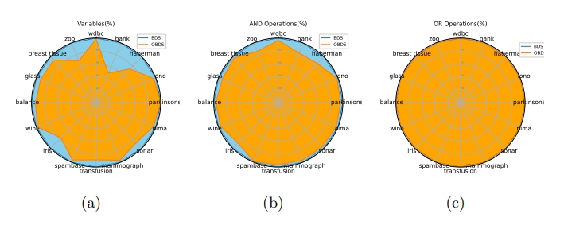

## Overview
CTRF is accepted paper in 27th International Conference on Pattern Recognition (ICPR), Kolkata, India. The mission of CTRF is to help users easily and efficiently transform Random Forests into tractable circuits. CTRF exploits bayesian learning and boolean algebra to achieve high efficiency. Key features of CTRF are as follows.
* Works for any number of variables.
* Reduction in variables and logical operations.
* Supported Operating System(s): Linux and Windows.
* Support classification, tested on UCIML datasets.

## Getting Started

### Requirements
1. matplotlib
2. numpy
3. pandas
4. scikit-learn
5. scipy
6. pyeda + related this VS distribution file (https://www.microsoft.com/en-us/download/details.aspx?id=30679)
7. gmm_mml

## Project Directory Structure

<pre>
CTRF_RRPR24/
│
├── CTRF/
│   ├── *All python files*
│   ├── Output/
│   │   └── *All pickle files*
│   ├── Training Files/
│   │   └── *All training files csv*
│   └── sample_images/
│       └── Accuracy.png
│       └── logical.png
│       └── bank_folds_train.png
│       └── bank_folds_predict.png
</pre>


### Quick Install

        *  pip install  https://github.com/msrinivaskgp/CTRF_RRPR24
    
* Currently only support python3

### Build from source
```bash
git clone  https://github.com/msrinivaskgp/CTRF_RRPR24
cd CTRF_RRPR24
#under the directory of CTRF_RRPR24 we can train and predict the models
```

You will see info about the accuracies of  RF, RF-V,BDS, OBDS after successful running predictf()

## Datasets

| Dataset      | Training samples | Test samples | Classes |
|--------------|------------------|--------------|---------|
| wdbc         | 454              | 114          | 2       |
| bank         | 1097             | 274          | 2       |
| haberman     | 244              | 61           | 2       |
| iono         | 280              | 70           | 2       |
| parkinsons   | 155              | 39           | 2       |
| pima         | 614              | 153          | 2       |
| sonar        | 166              | 42           | 2       |
| mammograph   | 663              | 166          | 2       |
| transfusion  | 598              | 149          | 2       |
| spambase     | 3681             | 920          | 2       |
| iris         | 119              | 30           | 3       |
| wine         | 142              | 35           | 3       |
| balance      | 500              | 125          | 3       |
| breast tissue| 85               | 21           | 6       |
| glass        | 171              | 43           | 6       |
| zoo          | 81               | 20           | 7       |

## Usage

These datasets are split into 80% training and 20% testing. You can use them to evaluate and benchmark the proposed models.

### sample output 

  ## training outputs for bank.csv

<div align="center">
  
</div>

## model accuracies for bank.csv using predict functions

<div align="center">
  
</div>

### Comparing accuracy of RF, RF-V, BDS an OBDS on UCIML datasets.

<div align="center">
  
</div>

### Comparing AND an OR operations on UCIML datasets.

<div align="center">
  
</div>

### Related papers
* Choi A, Shih A, Goyanka A, Darwiche A. On symbolically encoding the behavior
of random forests. arXiv preprint arXiv:2007.01493. 2020 Jul 3. [pdf](https://arxiv.org/pdf/2007.01493)

* Audemard, Gilles, Frédéric Koriche, and Pierre Marquis. On tractable XAI queries based on compiled representations. Proceedings of the International Conference on Principles of Knowledge Representation and Reasoning. Vol. 17. No. 1. 2020. [pdf](https://proceedings.kr.org/2020/86/kr2020-0086-audemard-et-al.pdf)

**Principal Investigator**


<a href="https://www.linkedin.com/in/debdoot/">Dr Debdoot Sheet</a> </br>
Department of Electrical Engineering,</br>
Indian Institute of Technology Kharagpur</br>
email: debdoot@ee.iitkgp.ac.in 


Contributors

<a href="https://www.linkedin.com/in/maddimsetti-srinivas-5233801b/"> Maddimsetti Srinivas </a> </br>
Department of Electrical Engineering,</br>
Indian Institute of Technology Kharagpur</br>
email: msrinivas@iitkgp.ac.in


<a href="https://www.linkedin.com/in/sai-hemanth-sattenapalli-3874b010b//">Sattenapalli Sai hemanth </a> 
<br>Galatic Geeks</br>
email: saihemanth.s@outlook.com


<a href="https://www.linkedin.com/in/raviteja-garlapati-147a71172/">Raviteja Garlapati </a> 
<br>Galatic Geeks</br>
email: garlapatiravitejag.grr@outlook.com

